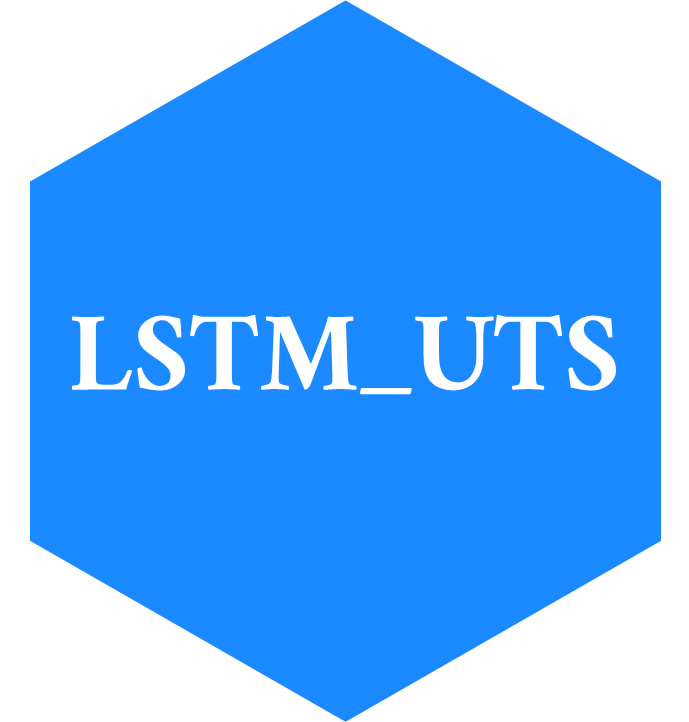

# LSTM_UTS

 This repository contains the source of **Simple implementation of LSTM networks for univariate time series forecasting** a web app made with R for the implementation of vanilla LSTM networks for univariate time series forecasting.

You can see the dependencies in the dependecies.R file

Launch application:

``` r
shiny::runGitHub(repo = "davidrsch/simple-LSTM-networks-for-univariateTS", ref = "main")
```

or try it at [connect.posit.cloud](https://davidrsch-lstm-uts.share.connect.posit.cloud).

You're seing an updated version of the application **Simple implementation of LSTM networks for univariate time series forecasting** that was previously available at [this link](https://daviddrsch.shinyapps.io/Simple_LSTM_for_univariate_TS_forecasting/) in [shinyapps.io](https://www.shinyapps.io/).

**Why the update?**

The update was done because the previous version wasn't created following development best practices, such as **modular coding**, which ensures **scalability, maintainability, and easier debugging**. Additionally, comprehensive **unit, integration, and end-to-end tests** were lacking, which are crucial for **ensuring code reliability, detecting bugs early, and verifying that both individual components and the entire system function as expected without breaking existing functionality.**

This new version as the one before is powered by the **R programming language** and the **Keras interface** and **Tensorflow** engine for building neural networks models. It also features an updated user interface, enhancing the overall user experience with a more modern and intuitive design.

**How to use it?**

1. Import a file that contains the time series for which you want to build a model, accepted files formats are: csv, tsv, xlsx, and xls.
2. Modify the import file configuration according to the imported file.
3. Once the file is properly imported you can select the variable to model using **Forecast variable** select, optionally you can select a **Sequence variable**
4. Once the **Forecast variable** is selected a page button will appear, click next to navigate to the configuration options.


5. Once in configuration options you can adjust the experiment to your necessities. Each configuration option has a detailed explanation on how the different configurations affects the experiment that will be executed.
6. After setting up your experiment a **Run** button will be displayed between the page buttons, click it.


7. After clicking the **Run** button a modal will appear, informing you of the amount of model and test that will be executed. The table on the modal can be use to filter the configuration options. Once you have the desired options click the **Start** button.


8. After clicking the **Start** button a spinning modal will appear until experiment is finished. Once experiment is finished the download modal will appear. Click the **Download** button to download a json file with the experiment results.


9. Once you have download the experiments results you can analyze them using the tool available at [https://davidrsch.github.io/lstm_uts_dashboard/](https://davidrsch.github.io/lstm_uts_dashboard/).

## Enjoy experimenting!

